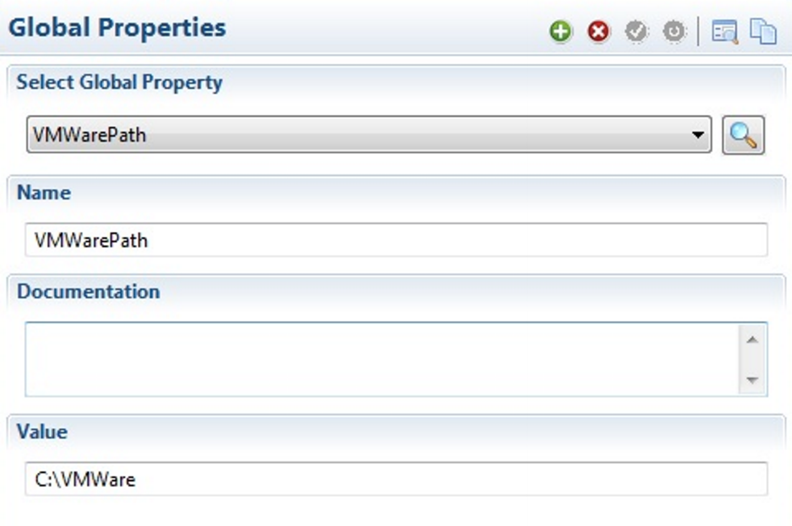

# Installation

VMWare Connector Installation

## Requirements

Before beginning the installation, ensure that the system requirements are met. The supported software include:

* Any supported version of Windows with .NET Framework 4.5 installed.
* Java version 8.
* A supported version of the MSLSAM installed on the machine.

:::info Note 

The SMA VMWare connector will need to have the address of the host supporting VMWare web services in the configuration file.

:::

The OpCon VMWare Connector incorporates VMWare Jobs into the OpCon environment communicates with VMWare web services provided by Center and ESXi 5.5 to provide the following capabilities:

| Name | Description |
| ---- | ----------- |
| BackUp | Backup VMWare machine instances. |
| Clone | Create a virtual machine. |
| Information | Retrieve information from the VMWare environment. |
| PowerOps | PowerOn / PowerOff VMWare instances, Reboot / Shutdown / Restart / Suspend guest operating systems. |
| Reconfigure | Change VMWare configurations by changing the number of CPU's or memory size. |
| SnapShot | Take a snapshot, delete a snapshot and revert to a snapshot. |
 
For these operations to function effectively on the virtual machine, VMWare Tools must be installed on the virtual machine.
 
For Reconfigure changes (CPU & memory), the options must enabled for the virtual machine (VMWare Settings, Options, Memory/CPU hotplug). It should be noted that these options will only be allowed by VMWare if the target operating system supports these capabilities.
 
:::info Note 

The Oracle JRE prerequisite has been removed from the installation package for this product. You must have a functional Java Runtime Environment installed prior to installation for this product to work.

:::

## New Installation

To install a new VMWare Connector, complete the procedures in this section.

### Connector Installation

1. Log in to the machine as a Local Administrator.
2. Download the files from the [https://files.smatechnologies.com](https://files.smatechnologies.com) site.
3. Enter your valid username and password and click **Login**.
4. Navigate to **Root Folder/Connectors and Add-ons/Connectors/VMWare**.
5. Double-click the **SMA OpCon VMWare Connector Install.exe**. The **Select Language** screen displays.
6. Select the **desired language** for the installation screens and click **OK**. The **Welcome** screen displays.
7. Click **Next**.
**In the remaining wizard screens**:
8. Complete the wizard.
**In the last** wizard screen**:
9. Click **Done**.

### VMWarePath Global Property Configuration

1. Log in to the Enterprise Manager on the Windows machine where an Enterprise Manager is installed.
2. Double-click on **Global Properties** under the **Administration** topic in the **Navigation Panel**. The **Global Properties** screen displays.
3. Click **Add** on the **Global Properties** toolbar.
4. Enter _VMWarePath_ in the **Name** text box.
5. Enter the documentation in the **Documentation** text box.
**In the Value text box:**
6. Enter the path to the _SMAVMWare.exe on the Windows machine_. **Do not** include the trailing backslash in the path.

:::tip Example

C:\Program Files\OpConxps\VMWare x64

:::

7. Click **Save** on the **Global Properties** toolbar.

### Enterprise Manager Sub-Type Installation

If you need to update the Enterprise Manager with a screen to define the VMWare jobs, you will need to install the VMWare Job Sub-Type. Follow the procedure in this section to install the plug-in package.
 
1. Log in to the machine where the Enterprise Manager is installed.
2. Navigate to the **EnterpriseManager** folder in Windows Explorer.

:::tip Example 

C:\Program Files\OpConxps\EnterpriseManager x64

:::

3. Confirm the **dropins** folder exists. If the folder does not exist, right-click in the **EnterpriseManager** folder, select **New > Folder**, and name the folder **dropins**.
4. Navigate to the location where you installed the VMWare Connector.

:::tip Example 

C:\Program Files\OpConxps\VMWare x64

:::

5. Open the **EMPlugins** folder and copy the jar file.
	
:::tip Example 

com.sma.ui.core.jobdetails.vmware_1.0.0.yyyymmddhhss.jar

:::

6. Paste the jar file to the **EnterpriseManager\dropins** folder on the Enterprise Manager machine.

:::tip Example 

C:\Program Files\OpConxps\EnterpriseManager x64\dropins\com.sma.ui.core.jobdetails.vmware_1.0.0.yyyymmddhhss.jar

:::

7. Log in to the Enterprise Manager on the Windows machine where an Enterprise Manager is installed.
8. Double-click on **Job Master** under the **Administration** topic in the **Navigation Panel**. The **Job Master** screen displays.
9. Select a **schedule** in the **Schedule** drop-down list.
10. Click **Add** on the **Job Master** toolbar.
**Under Job Properties in the Job Details frame:**
11. Select **Windows** in the **Job Type** drop-down list.
12. Select **VMWare** in the **Job Sub-Type** drop-down list to confirm that the sub-type is installed.
 
After the installation is complete, the installed directory contains the connector executable, a single jar file containing the required libraries, and an **Connector.config** file.
 

### Solution Manager sub-type installation

It should be noted that all interactions with the Solution Manager sub-type can only be completed using Solution Manager.

Download the ACSVMWare zip file from the ftp site under OpCon Releases\Integrations\VMWARE.

Extract the ACSVMWare directory and copy this into the \SAM\plugins for OpCon and relay installations.

For OpCon installations stop and restart the SMA OpCon RestAPI and SMA OpCon Service Manager services, for Relay stop and restart the Relay Service.
Create the scripts

When using the Solution Manager sub-type, two scripts must be created. The first script contains the Connector.config information and the second script contains the drop-down list information.

Using Solution Manager

    Select Library.
    Select Scripts.
    Select Script Types from the upper right hand corner.
        Select +Add
        In the Name field enter ACSVMWare.
        In the File Extension field enter txt.
        In the Description field enter Used for ACSVMWare Integration.
        Select Save.
    Select Script Runners from the upper right hand corner.
        Select +Add
        In the Name field enter ACSVMWare.
        In the OS field select VMWare from the drop-down list.
        In the Type field select ACSVMWare from the drop-down list.
        In the Command field enter cmd.exe /c.
        Select Save.
    Select Scripts from the upper right hand corner.
        Create the Connector.config script.
        Select +Add.
        In the Name field enter a name for the script. It is suggested using the proposed agent name and append _config to the name.
        In the Type field select ACSVMWare from the drop-down list.
        Assign the required roles.
        In the Script paste the contents of the created Connector.config file.
        Select Save.

Create VMWare Agent Definition

Using Solution Manager

    Select Library.

    Select Agents.
        Select +Add
        In the Name field enter the name of the agent.
        Select VMWare from the Type drop-down list.
        In the VMWare Settings section enter the required information.
        In the Client Information section
            In the Directory field enter the installation directory of the VMWare Connector.
            In the Name field insert vmware.exe (default value).
            In the Config File Name field insert Connector.config (default value).
        In the Config Script section
            Select ACSVMWare from the Script Runner drop-down list.
            Select the config script you previously created from the Script drop-down list.

    Select Save.

## Upgrade Installation

To upgrade the VMWare Connector, simply install the new package to the same directory as the previous installation. The installation package will preserve your configuration files automatically. For installation instructions, refer to [New Installation](installation#new-installation).

## Silent Mode

To learn how to install the VMWare Connector in silent mode, refer to the [Silent Mode](https://help.smatechnologies.com/opcon/core/installation/components#silent-mode-install) section in the **OpCon Installation** online help.